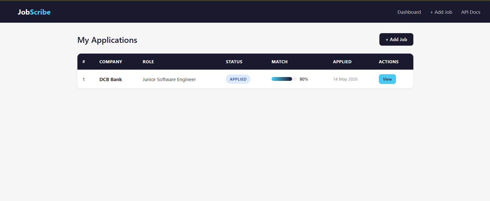
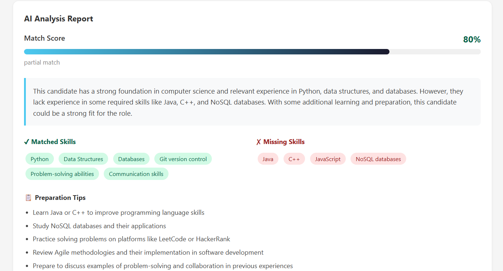

# JobScribe

> AI-powered job application tracker that analyzes your resume against job descriptions and tells you exactly where you stand.

[](https://github.com/joeljoymon/jobscribe/actions/workflows/tests.yml)


**Live Demo:** https://jobscribe-joel.onrender.com

---

## The Problem

Freshers apply to 20-30 companies blindly — same resume everywhere,
no idea why they don't hear back. JobScribe fixes this by telling you
before you apply whether your resume matches the role, and exactly
what's missing.

---

## What It Does

**Track** — Add every job application with company, role, JD, and status.
Update status as things progress: applied → interview → offer.

**Analyse** — Upload your resume PDF. Paste the job description.
Llama 3.3 70B compares them and returns:

- Match score (0-100%)
- Skills you have that match
- Skills you're missing
- Honest verdict — should you apply?
- 5 likely interview questions tailored to this JD and your resume
- Preparation tips specific to the gap

**Dashboard** — See all applications in one place with match scores
and status badges.

---

## Screenshots

> Dashboard showing applications with match scores and status badges

> Job detail page with full AI analysis report

---

## Tech Stack

| Layer | Technology |
|---|---|
| Backend | Python, FastAPI |
| Database | SQLite via SQLAlchemy ORM |
| AI | Llama 3.3 70B via Groq API |
| PDF parsing | pypdf |
| Frontend | Jinja2 templates, HTML/CSS |
| Testing | pytest, 25 tests |
| CI/CD | GitHub Actions |
| Deployment | Render |

---

## Running Locally

```bash
# Clone the repo
git clone https://github.com/joeljoymon/jobscribe.git
cd jobscribe

# Create virtual environment
python -m venv venv
venv\Scripts\activate      # Windows
source venv/bin/activate   # Mac/Linux

# Install dependencies
pip install -r requirements.txt

# Add environment variables
# Create a .env file with:
# GROQ_API_KEY=your_key_here
# Get a free key at https://console.groq.com/keys

# Run the server
uvicorn app.main:app --reload

# Open in browser
# http://127.0.0.1:8000
```

---

## API Endpoints

| Method | Endpoint | Description |
|---|---|---|
| GET | `/` | Dashboard |
| POST | `/jobs/` | Add a job application |
| GET | `/jobs/` | List all applications |
| GET | `/jobs/{id}` | Get one application |
| PATCH | `/jobs/{id}` | Update status or notes |
| DELETE | `/jobs/{id}` | Remove application |
| POST | `/jobs/{id}/upload-resume` | Upload resume PDF |
| POST | `/jobs/{id}/analyze` | Run AI gap analysis |

Full interactive API docs at `/docs`.

---

## Project Structure

```
jobscribe/
├── app/
│   ├── main.py          ← FastAPI app, HTML routes
│   ├── models.py        ← SQLAlchemy database table
│   ├── schemas.py       ← Pydantic request/response shapes
│   ├── database.py      ← database connection and session
│   ├── analyzer.py      ← Groq AI integration and PDF parsing
│   └── routers/
│       └── jobs.py      ← all job API endpoints
├── templates/
│   ├── base.html        ← shared layout and styles
│   ├── dashboard.html   ← applications list view
│   ├── job_detail.html  ← full analysis report view
│   └── add_job.html     ← add new application form
├── tests/
│   ├── conftest.py      ← test database setup and fixtures
│   └── test_jobs.py     ← 25 tests covering all endpoints
├── .github/
│   └── workflows/
│       └── tests.yml    ← CI runs tests on every push
├── requirements.txt
└── README.md
```

---

## What I Learned Building This

- Designing and building a REST API with FastAPI from scratch
- Database modeling with SQLAlchemy ORM — no raw SQL
- Separating concerns: schemas vs models vs routers
- Dependency injection pattern in FastAPI
- Integrating an LLM API with structured JSON prompt engineering
- Extracting text from PDF files with pypdf
- Server-side HTML rendering with Jinja2 templates
- Writing 25 tests covering positive and negative cases
- Dependency overrides for test database isolation
- Setting up CI/CD with GitHub Actions
- Deploying a Python web app to Render

---

## License

This project is licensed under the MIT License — see the [LICENSE](LICENSE) file for details.


## Screenshots



